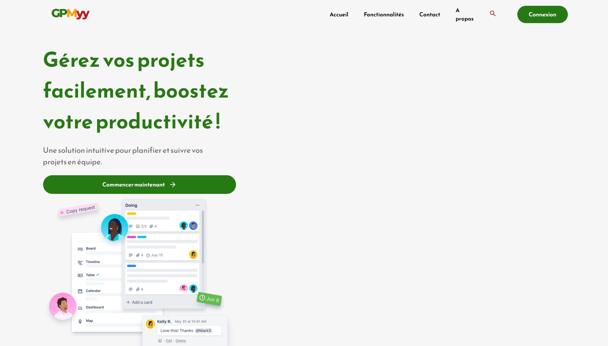
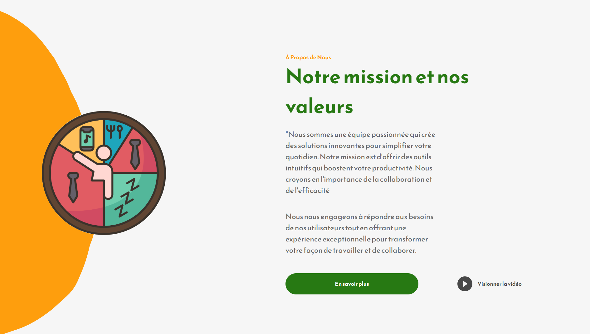
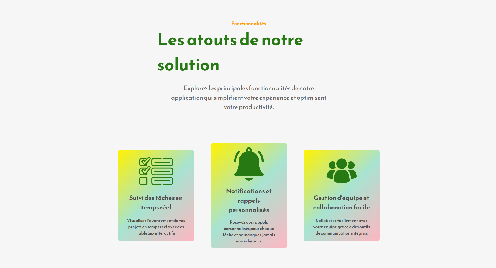
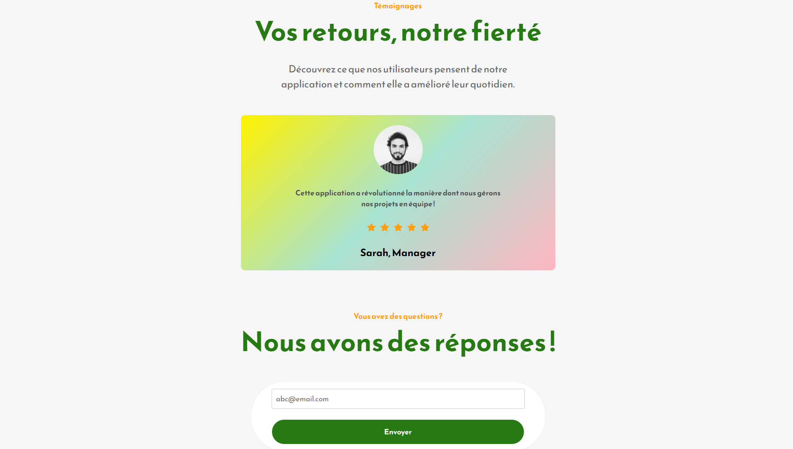
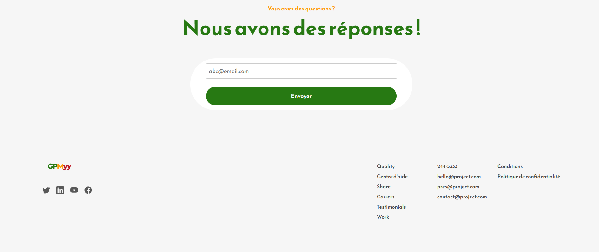
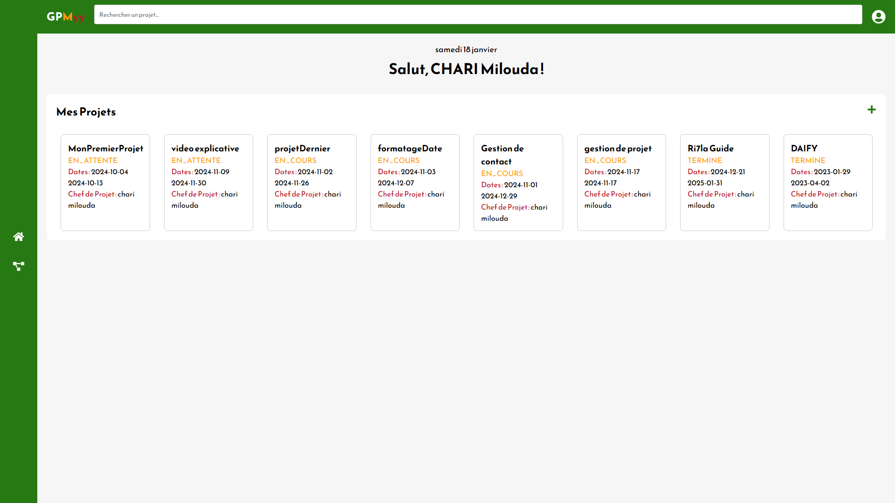
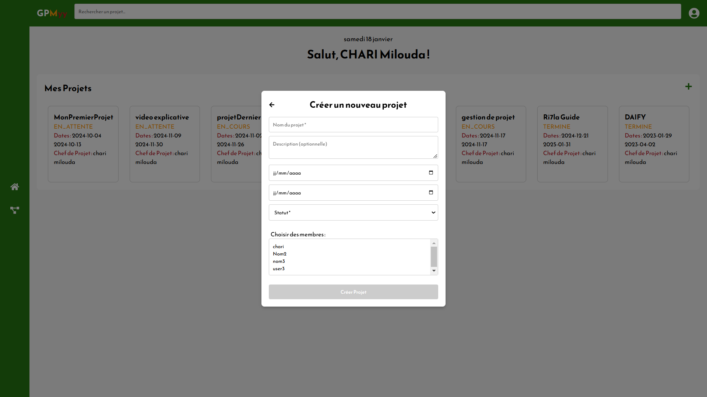
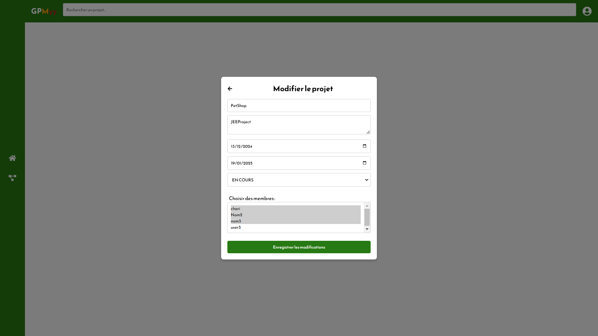
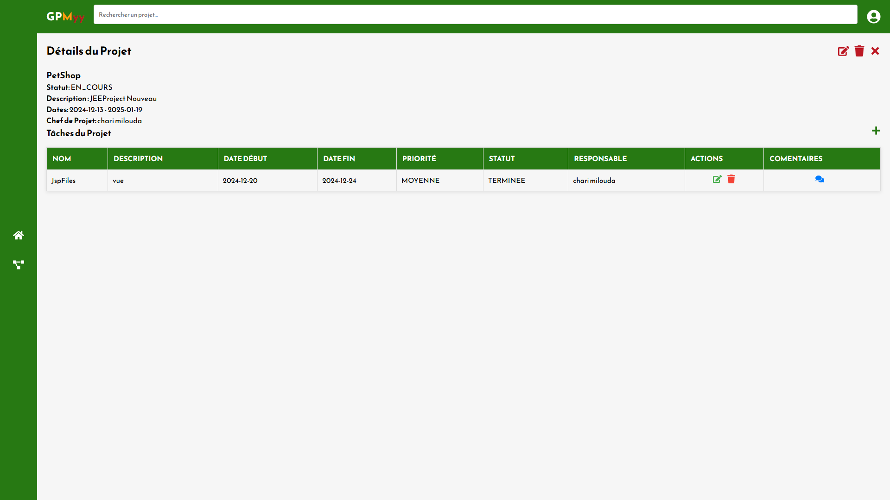

# 🚀 GPMYY - Gestion de Projets

## 📌 Contexte  
Dans un monde en pleine transformation numérique, la gestion de projets est devenue essentielle pour assurer l’efficacité et la réussite des organisations. Que ce soit pour des projets de petite ou grande envergure, une coordination précise, une communication fluide et une planification rigoureuse sont nécessaires.  

Ce projet vise à développer une **application de gestion de projets** permettant aux équipes de travailler efficacement et de collaborer en toute transparence.

---

## 🎯 Objectif du Projet  
L'application **GPMYY** a pour but de fournir un outil centralisé permettant de :
- 📅 **Planifier et suivre** l’avancement des projets et des tâches ✅  
- 🤝 **Faciliter la collaboration** entre les membres de l’équipe ✅  
- 📌 **Assurer une gestion transparente** des tâches et des ressources ✅  
---

## 👥 Public Cible  
L’application est destinée à plusieurs types d’utilisateurs :  
- **👑 Administrateurs** : Gestion des utilisateurs, rôles et accès (🚧 À développer)  
- **📂 Chefs de projet** : Création, planification et suivi des projets ✅  
- **👥 Membres de l’équipe** : Exécution des tâches et interactions en équipe (🚧 À développer)  

---

## 🛠️ Technologies Utilisées  

### **📌 Environnement de Développement**  
- **IDE Backend** : IntelliJ IDEA / Eclipse  
- **IDE Frontend** : Visual Studio Code  

### **💻 Backend**  
- **Spring Boot** : API RESTful rapide et performante  
- **Spring Security** : Gestion de l’authentification et des permissions  
- **MySQL** : Base de données relationnelle  

### **🎨 Frontend**  
- **React** : Framework JavaScript pour une interface dynamique  
- **Bootstrap** : Framework CSS pour un design responsive  

### **🧪 Outils de Test**  
- **Postman** : Tests des API pour garantir leur bon fonctionnement  

---

## ⚙️ Fonctionnalités  

### ✅ **Déjà développées**  
✔️ Création, modification et suppression de projets  
✔️ Gestion des tâches : assignation et suivi  
✔️ Authentification et sécurité via Spring Security  
✔️ API REST opérationnelle et testée avec Postman  

### 🚧 **En cours de développement**  
🔄 Gestion des rôles et permissions des utilisateurs  
💬 Système de commentaires et interactions sur les tâches  

---
## 📸 Captures d'Écran
 
 
 
 
 
 
 
 
 
  

## 📩 Contact
🔗 **LinkedIn** (https://linkedin.com/in/milouda-chari/)  
